# MyGoCloud Control Plane

A lightweight control plane for deploying containerized applications through a CLI.

The CLI communicates exclusively through a Go HTTP API. The API manages application state in PostgreSQL and orchestrates Docker containers — there is no direct CLI-to-Docker coupling.

The long-term goal is to evolve MyGoCloud into a small cloud platform. For now, it is intentionally a tiny project that focuses on building the foundations of such a system.

## 🎯 Why This Project?

After graduating with a Bachelor's Degree in Computer Science, I decided to take a creative break from the programming industry.

After spending a few months away from coding, I realized that the break was really from the university lifestyle — not from programming, building systems, and creating things.

I decided to make a comeback with a new language: Go.

This is one of my first larger personal projects where I deliberately chose not to build another small or modular application. Instead, I wanted to create something that could grow into a larger system and allow me to see how different components evolve and interact over time.

I particularly enjoy system design and thinking about software at a larger scale, so MyGoCloud is an opportunity to explore those ideas while learning Go.

## 🚀 What This Project Demonstrates

MyGoCloud is designed as a small-scale example of how a real-world platform CLI could be structured, inspired by platforms such as Heroku, Fly.io, and Vercel.

The project demonstrates:

- **Clean Architecture** — domain, repository, service, and handler layers
- **API-first architecture** — the CLI communicates only with the HTTP API
- **Dual Storage** — in-memory repositories for fast testing and PostgreSQL for production
- **Async Deployments** — background workers for deployment processing and status polling
- **Deployment Safety** — application-level locking prevents concurrent deployments and rollbacks
- **Container Orchestration** — the control plane manages Docker container lifecycle
- **Rollback Support** — failed or unwanted deployments can be rolled back to a previous successful version
- **CLI/API separation** — Docker-specific logic remains entirely inside the control plane
- **Message-based processing** — RabbitMQ is being introduced for asynchronous deployment jobs

## 🏗️ Architecture

The core architectural principle is:

**CLI → HTTP API → Control Plane → Docker**

The CLI never communicates directly with Docker. All application state and container orchestration are handled by the Control Plane API.

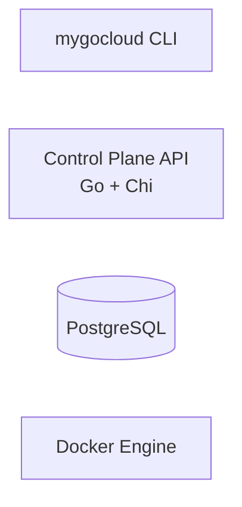

    CLI <-->|"HTTP / JSON"| API
    API <-->|"SQL"| DB
    API -->|"orchestrates"| Docker

    Docker --> Pull["pull"]
    Docker --> Run["run"]
    Docker --> Logs["logs"]

    CLI -.->|"No direct access"| Docker
```

This separation allows the CLI and control plane to evolve independently while keeping Docker-specific orchestration logic on the server side.

## 📨 Current Architecture — RabbitMQ

As the project evolves, asynchronous deployment processing is being moved toward a message-based architecture using RabbitMQ.

The goal is to separate API requests from deployment execution and create a foundation for future workers and distributed processing.

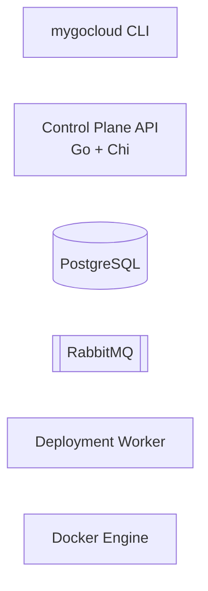

    CLI -->|"HTTP / JSON"| API
    API <-->|"SQL"| DB
    API -->|"Publish deployment job"| MQ
    MQ -->|"Consume job"| Worker
    Worker -->|"Pull / Start / Stop"| Docker
    Worker -->|"Update deployment status"| DB

    CLI -.->|"No direct access"| Docker
```

This introduces an additional boundary between the API and deployment execution:

**CLI → HTTP API → RabbitMQ → Worker → Docker**

The API is responsible for accepting and recording deployment requests, while workers are responsible for executing deployment jobs.

## 🚧 Build Phases

The project is being developed incrementally.

Each phase introduces another layer of the system while keeping the architectural foundations established in previous phases.

### Phase 1 — Control Plane API

#### Goal

Build the core HTTP API with PostgreSQL persistence.

#### Implemented

- Go HTTP server using `net/http` + `chi/v5`
- RESTful resources:
  - Users
  - Applications
  - Deployments
- PostgreSQL schema with migrations
- Relational structure:
  - `users`
  - `applications`
  - `deployments`
- POST / GET endpoints
- Structured JSON error responses
- Domain layer with repository interfaces
- Swappable repository implementations:
  - In-memory
  - PostgreSQL

#### Request Flow

```text
POST /users
GET /applications
      │
      ▼
Control Plane API
      │
      ▼
INSERT / SELECT
      │
      ▼
PostgreSQL
```

The API acts as the central entry point for all platform operations.

### Phase 2 — MyGoCloud CLI

#### Goal

Build a CLI that communicates exclusively with the Control Plane API.

#### Implemented

- Cobra-based CLI
- Commands:
  - `mygocloud login`
  - `mygocloud user`
  - `mygocloud app`
  - `mygocloud viz`
- Persistent CLI configuration
- API client package with:
  - HTTP timeouts
  - Error handling
  - API request abstraction
- Output printer supporting:
  - Table
  - JSON
  - YAML
- CLI integration tests using `httptest`
- In-memory services for isolated testing

#### CLI Architecture

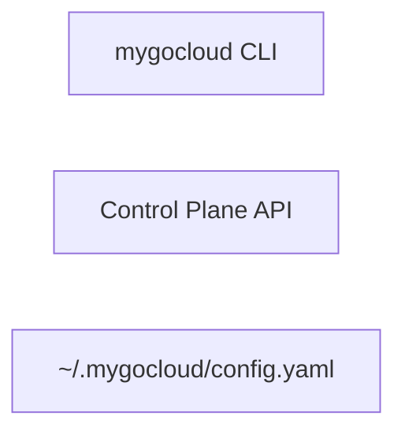

    CLI <-->|"HTTP / JSON"| API
    CLI <-->|"read / write"| CONFIG
```

The CLI is intentionally unaware of Docker.

**HTTP only — no direct Docker access.**

This architectural boundary is one of the core design decisions of the project.

### Phase 3 — Docker Integration

#### Goal

Introduce asynchronous container lifecycle management.

#### Implemented

- `docker.Executor` implementing the `Executor` interface
- Background deployment processing using goroutines
- Application-level mutex locks
- Container status polling
- Deployment lifecycle:
  - `pending`
  - `running`
  - `successful`
  - `failed`
- Rollback support
- Active container management
- Previous successful version lookup
- Container logs through `docker logs`

#### Deployment Flow

A deployment is created through the API and processed asynchronously by the control plane.

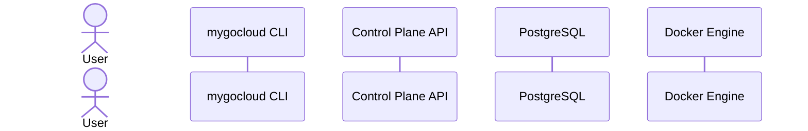

    User->>CLI: app deploy <app-id> --version 1.0.0

    CLI->>API: POST /deployments
    API->>DB: Create deployment
    DB-->>API: deployment = pending
    API-->>CLI: Deployment created

    API->>Docker: Pull image
    Docker-->>API: Image ready

    API->>Docker: Start container
    Docker-->>API: Container running

    API->>DB: Update status = successful

    CLI->>API: GET deployment status
    API-->>CLI: successful
```

## 🔄 Deployment Lifecycle

A typical deployment goes through the following states:

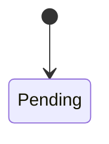

    Pending --> Running: Container started
    Pending --> Failed: Pull/start error

    Running --> Successful: Deployment completed
    Running --> Failed: Container failure

    Successful --> [*]
    Failed --> [*]
```

The deployment state is persisted in PostgreSQL, allowing the API to expose deployment history independently from the CLI.

## 🔙 Rollback

Rollback finds the most recent successful deployment, stops the currently active container, and redeploys the previous successful version.


    User->>CLI: app rollback <app-id>

    CLI->>API: POST /rollback
    API->>DB: Find last successful deployment
    DB-->>API: version 1.1.0

    API->>Docker: Stop current container
    Docker-->>API: Container stopped

    API->>Docker: Redeploy version 1.1.0
    Docker-->>API: Container running

    API->>DB: Update deployment status

    API-->>CLI: Rollback successful
```

## 🧪 Testing

The project contains several levels of testing, from isolated unit tests to CLI-to-API integration tests.

| Target | What It Runs | Purpose |
|---|---|---|
| `make test-unit` | `go test ./internal/... ./cli/config/... ./cli/printer/... ./cli/client/...` | Fast, isolated tests with mocked repositories/services |
| `make test-integration` | `go test -run Integration ./...` | End-to-end API tests with in-memory DB + noop executor |
| `make test-cli` | `go test ./cli/commands/...` | Cobra command tests with mock HTTP servers |
| `make test-cli-integration` | `go test -run TestCLI ./cli/...` | CLI → API integration using `httptest` |
| `make coverage` | Full suite + HTML report | Coverage report and visualization |

Run the complete test suite with:

```bash
make test
```

## 🚀 Quick Start

### 1. Start PostgreSQL

```bash
make docker-up
```

### 2. Start the API

```bash
make run
```

or:

```bash
go run ./cmd/api
```

The server starts on:

```text
:8080
```

### 3. Build the CLI

```bash
make build-cli
```

### 4. Configure the CLI

```bash
./bin/mygocloud login --endpoint http://localhost:8080
```

### 5. Create a user

```bash
mygocloud user create \
  --email dev@example.com \
  --name "Developer"
```

### 6. Create an application

```bash
mygocloud app create \
  --name api-gateway \
  --description "Edge proxy" \
  --image nginx \
  --owner-id <user-uuid>
```

### 7. Deploy a version

```bash
mygocloud app deploy <app-uuid> --version 1.0.0
```

### 8. Watch deployment status

```bash
mygocloud viz status <app-uuid> --watch
```

### 9. View deployment history

```bash
mygocloud app deployments <app-uuid>
```

### 10. Rollback

```bash
mygocloud app rollback <app-uuid>
```

### 11. Stream logs

```bash
mygocloud viz logs <app-uuid> --follow
```

## 📦 Example Deployment Scenario

Imagine a developer wants to deploy:

```text
api-gateway:v1.0.0
```

### 1. First Deployment

```bash
mygocloud app deploy <app-id> --version 1.0.0
```

The control plane:

```text
Create deployment
       ↓
     Pending
       ↓
   Pull image
       ↓
 Start container
       ↓
    Running
       ↓
   Successful
```

### 2. Deploy a New Version

```bash
mygocloud app deploy <app-id> --version 1.1.0
```

The control plane:

```text
Deploy 1.1.0
     ↓
Stop current container
     ↓
Start 1.1.0
     ↓
  Running
     ↓
Successful
```

The previous container is stopped and the new version becomes active.

### 3. Rollback

```bash
mygocloud app rollback <app-id>
```

The control plane:

```text
Rollback
   ↓
Find last successful version
   ↓
Stop current container
   ↓
Redeploy previous version
   ↓
Successful
```

## 📂 Project Structure

```text
.
├── cmd/
│   ├── api/                 # API server entrypoint
│   └── mygocloud/           # CLI entrypoint
│
├── cli/
│   ├── client/              # HTTP API client
│   ├── commands/            # Cobra commands
│   ├── config/              # CLI configuration
│   └── printer/             # table / JSON / YAML output
│
├── internal/
│   ├── config/              # Environment-based configuration
│   ├── domain/              # Models, repository interfaces, services
│   ├── handler/             # HTTP handlers
│   ├── middleware/          # HTTP middleware
│   ├── repository/          # Memory + PostgreSQL repositories
│   ├── server/              # HTTP server bootstrap
│   ├── service/             # Business logic
│   └── executor/            # Docker abstraction
│
├── migrations/              # PostgreSQL migrations
└── Makefile                 # Build and test automation
```

## 🧠 Design Principles

### API-first

The CLI is a client of the Control Plane API rather than an orchestrator itself.

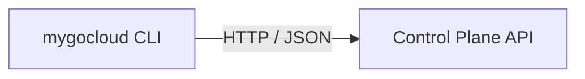
```

The CLI does not contain Docker-specific logic.

### Separation of Concerns

Docker-specific operations are isolated behind the `Executor` interface.

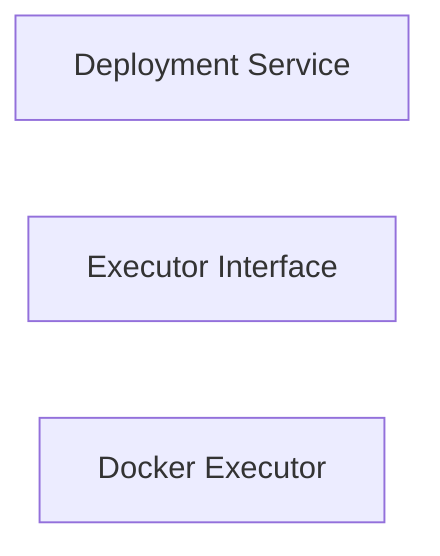

    Service --> Interface --> Docker
```

This allows the business logic to remain independent from the underlying container runtime.

### Swappable Infrastructure

Repositories are defined through interfaces, allowing the application to use either in-memory implementations or PostgreSQL.

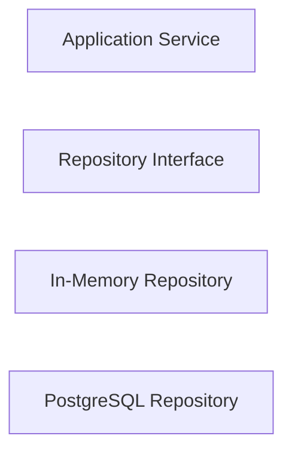

    Service --> Interface
    Interface --> Memory
    Interface --> PostgreSQL
```

### Testability

The architecture allows services, repositories, HTTP handlers, and CLI commands to be tested independently.

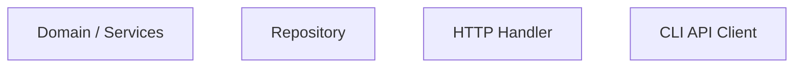

    Unit["Unit Tests"]
    Integration["Integration Tests"]
    CLI["CLI Tests"]

    Domain --> Unit
    Repository --> Unit
    Handler --> Integration
    Client --> CLI
```

### Concurrency Safety

Application-level locking prevents conflicting deployments and rollbacks from running simultaneously for the same application.

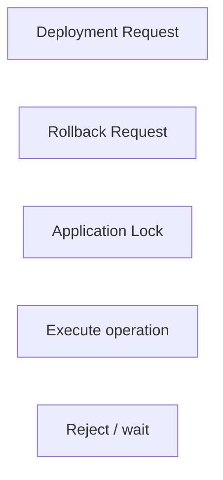

    Deploy --> Lock
    Rollback --> Lock
    Lock -->|"Lock acquired"| Execute
    Lock -->|"Already locked"| Reject
```

### Incremental Architecture

The project is intentionally being built in phases.

Each phase adds another layer of functionality without abandoning the architectural foundations established in previous phases.

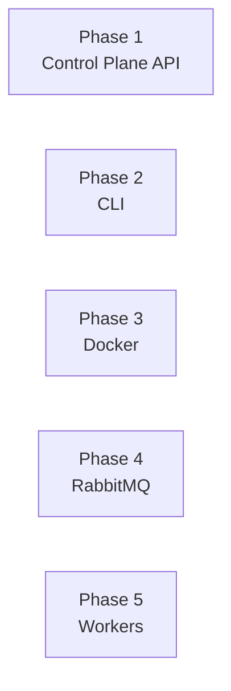

    P1 --> P2 --> P3 --> P4 --> P5
```

## 🛣️ Future Direction

The long-term goal is to gradually evolve MyGoCloud from a small deployment control plane into a miniature cloud platform.

Possible future phases include:

- Authentication and authorization
- API tokens
- Multiple container instances
- Health checks
- Resource limits
- Environment variables and secrets
- Networking
- Persistent volumes
- Deployment strategies
- Improved log streaming
- Metrics and monitoring
- Job/workload management
- Multi-node container execution
- Kubernetes integration
- Web dashboard
- Cloud-provider integration

The goal is not to immediately build a production cloud platform, but to grow the system incrementally and explore the engineering challenges that appear as the architecture becomes more complex.

## 📌 Current Status

**Current version:** Phases 1–3 completed, Phases 4–5 in development

### Completed

- REST API
- PostgreSQL persistence
- CLI client
- In-memory testing infrastructure
- Docker integration
- Asynchronous deployments
- Deployment history
- Rollbacks
- Container logs
- Automated testing

### Currently Working On

- RabbitMQ integration
- Message-based deployment processing
- Deployment workers
- Improved asynchronous architecture

The project is intentionally small for now, but the architecture is designed to support future expansion.

## ⭐ Project Philosophy

MyGoCloud is not intended to compete with production cloud platforms.

The goal is to build a small system, understand the engineering behind it, and gradually evolve it into something more complex.

Each new phase is an opportunity to explore another real-world engineering problem:

```text
Foundation
    ↓
API Design
    ↓
Client Architecture
    ↓
Container Orchestration
    ↓
Distributed Messaging
    ↓
Background Workers
    ↓
Future Scaling
```

The project is an ongoing exploration of Go, distributed systems, system design, and cloud infrastructure.
